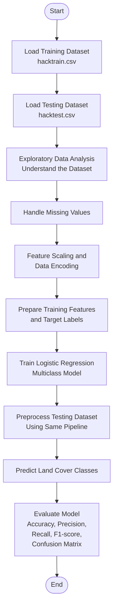

 # Land Cover Classification
# 1. Introduction

Land cover classification is an important task in environmental monitoring, urban planning, agriculture, and natural resource management. Accurate identification of different land cover types helps governments, researchers, and environmental organizations understand changes in vegetation, monitor natural resources, and make informed decisions for sustainable development.

This project focuses on classifying land cover into six categories: **Water, Impervious, Farm, Forest, Grass, and Orchard** using a **Logistic Regression** model for multiclass classification. The classification is based on **Normalized Difference Vegetation Index (NDVI)** time-series data obtained from satellite imagery, along with land cover labels collected from **OpenStreetMap (OSM)**.

NDVI is a widely used vegetation index that measures the health and density of vegetation by comparing the amount of near-infrared light reflected by plants with the amount of visible red light they absorb. It is calculated using the following formula:

**NDVI = (NIR − RED) / (NIR + RED)**

where:

* **NIR** represents Near-Infrared Reflectance.
* **RED** represents Red Reflectance.

Healthy vegetation reflects more near-infrared light and absorbs more red light, resulting in higher NDVI values. On the other hand, water bodies, urban areas, and barren land generally produce lower NDVI values. By observing NDVI values over time, different land cover types can be distinguished based on their seasonal vegetation patterns.

Before training the model, an exploratory data analysis (EDA) was performed to understand the characteristics of the dataset. Missing values were carefully analyzed and imputed using appropriate techniques. The data then underwent preprocessing steps such as feature scaling and data encoding to ensure that it was suitable for machine learning.

The Logistic Regression model was trained using the **hacktrain.csv** dataset and evaluated on the **hacktest.csv** dataset. The performance of the model was measured using standard classification metrics to assess its ability to correctly classify different land cover categories.

Overall, this project demonstrates a complete machine learning workflow, starting from data preprocessing and feature engineering to model training, prediction, and evaluation for multiclass land cover classification.

# 2. File Structure

The project is organized in a simple and structured manner so that each file has a clear purpose. This makes it easier to understand the workflow and reproduce the results.

```text
Land_Cover_Classification/
│
├── Forest_Land_Classification.ipynb
├── hacktrain.csv
├── hacktest.csv
├── requirements.txt
└── README.md
```

### 2.1 Forest_Land_Classification.ipynb

This Jupyter Notebook contains the complete implementation of the project. It includes every stage of the machine learning pipeline, from loading the datasets to evaluating the final model. The notebook covers:

1. Importing the required libraries.
2. Loading the training and testing datasets.
3. Performing exploratory data analysis (EDA).
4. Handling missing values.
5. Preprocessing the data, including feature scaling and data encoding.
6. Training the Logistic Regression model.
7. Making predictions on the test dataset.
8. Evaluating the model using different performance metrics.
9. Visualizing the results where necessary.

### 2.2 hacktrain.csv

This file contains the training dataset used to build the Logistic Regression model. It includes:

1. NDVI time-series features.
2. OpenStreetMap (OSM) land cover labels.
3. The target class for each training sample.

The model learns the relationship between the NDVI features and the corresponding land cover class from this dataset.

### 2.3 hacktest.csv

This file contains the testing dataset used to evaluate the trained model. It contains the same input features as the training dataset but does not include the target labels. The trained model predicts the land cover category for each sample in this dataset.

### 2.4 requirements.txt

This file lists all the Python libraries required to run the project successfully. Installing these dependencies ensures that the project can be reproduced on another system without compatibility issues.

### 2.5 README.md

This file provides complete documentation for the project. It explains the project objective, dataset, workflow, model architecture, training process, evaluation methods, project structure, software requirements, and possible future improvements.

# 3. Dataset

The project uses two datasets, one for training the model and another for testing its performance. Both datasets are built from **NDVI (Normalized Difference Vegetation Index) time-series data** obtained from satellite imagery, while the land cover labels are provided using **OpenStreetMap (OSM)**. Together, these datasets enable the model to learn the characteristics of different land cover types and make predictions on unseen data.

## 3.1 Training Dataset

The **hacktrain.csv** file is used to train the Logistic Regression model. It contains NDVI time-series features along with the corresponding land cover labels for each sample.

Each record in the training dataset represents a geographical location and includes:

1. An identification column.
2. NDVI values collected over multiple time periods.
3. The corresponding land cover class.

The target variable belongs to one of the following six classes:

1. Water
2. Impervious
3. Farm
4. Forest
5. Grass
6. Orchard

The model learns the relationship between the NDVI patterns and these land cover classes during the training process.

---

## 3.2 Testing Dataset

The **hacktest.csv** file is used to evaluate the trained model.

It contains:

1. An identification column.
2. NDVI time-series features.

Unlike the training dataset, the testing dataset does not contain the target class labels. After applying the same preprocessing steps used for the training data, the trained model predicts the land cover category for each sample.

---

## 3.3 NDVI Features

The main input features in this project are **NDVI time-series values**.

NDVI is calculated using the formula:

**NDVI = (NIR − RED) / (NIR + RED)**

where:

1. **NIR** represents Near-Infrared Reflectance.
2. **RED** represents Red Reflectance.

Healthy vegetation reflects a large amount of near-infrared light while absorbing most of the red light for photosynthesis. As a result, healthy vegetation generally produces higher NDVI values, whereas water bodies, urban areas, and barren land produce lower NDVI values.

Since NDVI values are collected over multiple time periods, they capture seasonal changes in vegetation, making them useful for distinguishing different land cover types.

---


## 3.4 Dataset Summary

The dataset used in this project has the following characteristics:

1. Data source: Satellite imagery and OpenStreetMap (OSM).
2. Input features: NDVI time-series values.
3. Output classes: Water, Impervious, Farm, Forest, Grass, and Orchard.
4. Training file: **hacktrain.csv**.
5. Testing file: **hacktest.csv**.
6. Classification type: Multiclass classification.
7. Machine learning algorithm: Logistic Regression.

 # 4. Project Workflow

The project follows a systematic machine learning workflow that begins with raw NDVI time-series data and ends with the prediction of land cover classes. Each step plays an important role in preparing the data, training the model, and evaluating its performance.



## 4.1 Load the Datasets

The first step is to load the training and testing datasets into the notebook.

1. **hacktrain.csv** is used to train the Logistic Regression model.
2. **hacktest.csv** is used to generate predictions after the model has been trained.

---

## 4.2 Explore the Data

Before building the model, an exploratory data analysis (EDA) is performed to better understand the dataset.

The analysis includes:

1. Understanding the available features.
2. Checking the shape of the dataset.
3. Identifying missing values.
4. Examining the distribution of features.
5. Detecting possible outliers.

This step provides useful insights into the quality of the data and helps determine the preprocessing techniques that should be applied.

---

## 4.3 Data Preprocessing

The datasets are cleaned and prepared before training the model.

The preprocessing steps include:

1. Removing unnecessary columns if required.
2. Handling missing values using an appropriate imputation technique based on the EDA results.
3. Encoding categorical information wherever necessary.
4. Standardizing numerical features using **StandardScaler**.

Applying the same preprocessing pipeline to both the training and testing datasets ensures consistency during prediction.

---

## 4.4 Prepare the Training Data

After preprocessing, the training dataset is divided into:

1. Input features (**X**)
2. Target labels (**y**)

The target labels represent one of the six land cover classes:

1. Water
2. Impervious
3. Farm
4. Forest
5. Grass
6. Orchard

---

## 4.5 Train the Logistic Regression Model

The processed training dataset is used to train a multiclass Logistic Regression model.

During training, the model learns the relationship between the NDVI time-series features and the corresponding land cover classes. The learned parameters are then used to classify new and unseen samples.

---

## 4.6 Predict the Land Cover Classes

After training, the same preprocessing steps are applied to the testing dataset.

The trained model then predicts the land cover class for every sample in **hacktest.csv**.

---

## 4.7 Evaluate the Model

The performance of the trained model is evaluated using standard classification metrics.

The evaluation includes:

1. Accuracy
2. Precision
3. Recall
4. F1-score
5. Confusion Matrix
6. Classification Report

These metrics provide a comprehensive understanding of how well the model performs across all land cover categories.

---

## 4.8 Generate Final Predictions

Once the evaluation is complete, the trained model is used to generate the final land cover predictions for the testing dataset.

The predicted classes can then be used for environmental monitoring, vegetation analysis, and land use planning.

---

# 5. Model Used

This project uses **Logistic Regression**, a supervised machine learning algorithm for multiclass classification. The model learns the relationship between the NDVI time-series features and the corresponding land cover classes, allowing it to predict the most likely class for new and unseen samples.

---

## 5.1 Logistic Regression

Logistic Regression is a statistical classification algorithm that estimates the probability of an input sample belonging to each possible class. Unlike linear regression, which predicts continuous values, Logistic Regression predicts categorical outcomes.

In this project, the model classifies each land sample into one of the following six land cover classes:

1. Water
2. Impervious
3. Farm
4. Forest
5. Grass
6. Orchard

---

## 5.2 Why Logistic Regression?

Logistic Regression was selected because it offers several advantages for this classification task.

1. It is simple to implement and computationally efficient.
2. It performs well on structured numerical datasets.
3. It produces probabilistic predictions that are easy to interpret.
4. It can naturally handle multiclass classification.
5. It serves as a strong baseline model for comparing more complex machine learning algorithms.

---

## 5.3 Model Configuration

The Logistic Regression model was implemented using Scikit-learn with the following configuration.

| Parameter | Value |
|-----------|-------|
| Solver | saga |
| Penalty | L1 |
| Regularization Strength (C) | 0.5 |
| Maximum Iterations | 300 |
| Classification Type | Multiclass (Multinomial) |

The **SAGA** solver was chosen because it supports **L1 regularization** and can efficiently optimize multiclass Logistic Regression models on larger datasets.

---

## 5.4 How Multiclass Classification is Performed

Since this project contains six land cover categories, the classification problem is a **multiclass classification** problem.

Modern versions of Scikit-learn perform multiclass Logistic Regression using the **Multinomial Logistic Regression** approach by default when the selected solver supports it, including the **SAGA** solver used in this project.

Unlike the older One-vs-Rest (OvR) approach, multinomial Logistic Regression trains **a single model** that considers all classes simultaneously.

The process works as follows.

### Step 1: Compute a score for every class

For each input sample, the model computes a linear score for every land cover class.

For example,

```
Water        → Score
Impervious   → Score
Farm         → Score
Forest       → Score
Grass        → Score
Orchard      → Score
```

Each score indicates how strongly the input sample is associated with a particular class.

---

### Step 2: Convert the scores into probabilities

The computed scores are passed through the **Softmax function**.

Softmax converts the scores into probabilities such that:

1. Every probability lies between 0 and 1.
2. The probabilities of all classes add up to 1.

For example,

| Class | Probability |
|--------|------------:|
| Water | 0.03 |
| Impervious | 0.08 |
| Farm | 0.12 |
| Forest | 0.62 |
| Grass | 0.10 |
| Orchard | 0.05 |

---

### Step 3: Predict the final class

The model selects the class with the highest probability as the final prediction.

In the above example,

```
Forest → 0.62
```

Since Forest has the highest probability, the sample is classified as **Forest**.

---

## 5.5 Role of the Softmax Function

The Softmax function converts the scores of all classes into normalized probabilities.

Its main advantages are:

1. Every class receives a probability value.
2. The probabilities sum to 1.
3. All classes compete with one another during training.
4. The model learns the differences between all classes simultaneously.

This makes multinomial Logistic Regression more suitable for multiclass problems than training multiple independent binary classifiers.

---

## 5.6 Regularization

To improve the model's ability to generalize, **L1 regularization** is applied during training.

L1 regularization adds a penalty to the loss function based on the absolute values of the model coefficients.

Its benefits include:

1. Reducing overfitting.
2. Encouraging sparse model coefficients.
3. Reducing the influence of less important features.
4. Improving model interpretability.

---

## 5.7 Optimization Using the SAGA Solver

Training Logistic Regression involves finding the optimal model parameters that minimize the classification loss.

This optimization is performed using the **SAGA** solver.

The SAGA solver repeatedly updates the model coefficients until the loss function converges. It was selected because it:

1. Supports multinomial Logistic Regression.
2. Supports L1 regularization.
3. Works efficiently with large datasets.
4. Converges faster than many traditional optimization methods on high-dimensional data.

---

## 5.8 Overall Working of the Model

The overall workflow of the Logistic Regression model can be summarized as follows.

1. Receive the preprocessed NDVI time-series features.
2. Compute a score for each land cover class.
3. Convert the scores into probabilities using the Softmax function.
4. Select the class with the highest probability.
5. Return the predicted land cover category.


# 6. Results and Analysis

The performance of the Logistic Regression model was evaluated using the testing dataset to determine how accurately it could classify different land cover types based on NDVI time-series data. The evaluation was carried out using several standard classification metrics, including accuracy, precision, recall, F1-score, and the classification report.

---

## 6.1 Classification Results

| Class | Precision | Recall | F1-score | Support |
|-------|----------:|-------:|---------:|--------:|
| Farm | 0.72 | 0.50 | 0.59 | 841 |
| Forest | 0.90 | 0.97 | 0.94 | 6159 |
| Grass | 0.53 | 0.18 | 0.27 | 196 |
| Impervious | 0.83 | 0.81 | 0.82 | 669 |
| Orchard | 1.00 | 0.03 | 0.06 | 30 |
| Water | 0.88 | 0.53 | 0.66 | 105 |

**Overall Accuracy:** **88%**

### Macro Average

* Precision: **0.81**
* Recall: **0.50**
* F1-score: **0.56**

### Weighted Average

* Precision: **0.87**
* Recall: **0.88**
* F1-score: **0.87**

---

## 6.2 Interpretation of the Results

The Logistic Regression model achieved an overall **88% accuracy**, indicating that it correctly classified most land cover samples in the testing dataset. The weighted average F1-score of **0.87** also suggests that the model performs well overall when the distribution of different classes is taken into account.

However, the performance is not uniform across all land cover categories. Some classes are classified very accurately, while others remain challenging because of limited training samples and similarities in NDVI patterns.

### 6.2.1 Forest

The **Forest** class achieved the best performance among all categories.

1. Precision: **0.90**
2. Recall: **0.97**
3. F1-score: **0.94**

The high recall indicates that almost every forest sample was correctly identified. Since Forest is the largest class in the dataset, the model had sufficient examples to learn its vegetation patterns effectively.

---

### 6.2.2 Impervious

The **Impervious** class also achieved strong classification performance.

1. Precision: **0.83**
2. Recall: **0.81**
3. F1-score: **0.82**

The balanced precision and recall indicate that the model can reliably distinguish impervious surfaces, such as roads and buildings, from other land cover types.

---

### 6.2.3 Farm

The **Farm** class achieved moderate performance.

1. Precision: **0.72**
2. Recall: **0.50**
3. F1-score: **0.59**

The precision shows that many predicted farm samples are correct, but the recall indicates that only about half of the actual farm samples were identified correctly. This suggests that some farm areas have NDVI patterns similar to grasslands or forests, making them more difficult to classify.

---

### 6.2.4 Water

The **Water** class obtained relatively high precision but only moderate recall.

1. Precision: **0.88**
2. Recall: **0.53**
3. F1-score: **0.66**

When the model predicts a sample as water, the prediction is usually correct. However, nearly half of the actual water samples are classified as other land cover types, indicating some overlap in NDVI characteristics with other classes.

---

### 6.2.5 Grass

The **Grass** class is one of the most difficult categories for the model.

1. Precision: **0.53**
2. Recall: **0.18**
3. F1-score: **0.27**

The very low recall indicates that most grass samples are misclassified as other land cover types. This is likely because grasslands often exhibit seasonal vegetation patterns that are similar to farms or forests.

---

### 6.2.6 Orchard

The **Orchard** class shows the weakest performance.

1. Precision: **1.00**
2. Recall: **0.03**
3. F1-score: **0.06**

Although every predicted orchard sample is correct, the model identifies only a very small proportion of the actual orchard samples. This indicates that the model rarely predicts this class.

The primary reason is the severe class imbalance. With only **30 orchard samples**, the model has very limited information to learn representative NDVI patterns for orchards.

---

## 6.3 Effect of Class Imbalance

The distribution of samples across the six land cover classes is highly uneven.

| Class | Number of Samples |
|-------|------------------:|
| Forest | 6159 |
| Farm | 841 |
| Impervious | 669 |
| Grass | 196 |
| Water | 105 |
| Orchard | 30 |

The Forest class accounts for the majority of the dataset, while Orchard and Water contain comparatively few samples.

This imbalance influences the model's performance in several ways.

1. Majority classes are learned more effectively because they provide many training examples.
2. Minority classes are more difficult to learn due to the limited number of samples.
3. The overall accuracy remains high because a large proportion of the dataset belongs to the Forest class.

This effect is also reflected in the evaluation metrics.

* The **weighted average F1-score (0.87)** is high because it gives greater importance to classes with more samples.
* The **macro average F1-score (0.56)** is considerably lower because it gives equal importance to every class, regardless of how many samples each class contains.

The noticeable difference between these two scores indicates that the model performs much better on majority classes than on minority classes.

---

## 6.4 Overall Analysis

The results demonstrate that Logistic Regression provides a strong baseline for multiclass land cover classification using NDVI time-series data.

The model performs exceptionally well for the **Forest** and **Impervious** classes, where sufficient training samples allow it to learn clear decision boundaries. It achieves moderate performance for the **Farm** and **Water** classes, while the **Grass** and **Orchard** classes remain challenging because of limited training data and overlapping vegetation characteristics.

Overall, the model achieves an **88% classification accuracy**, showing that NDVI time-series data is highly informative for distinguishing different land cover types. However, the lower macro-average recall and F1-score indicate that performance across all classes is not balanced.

Future improvements could include collecting additional samples for minority classes, applying class balancing techniques, incorporating more satellite-derived features, or experimenting with more advanced machine learning algorithms such as Random Forest, XGBoost, or LightGBM to improve classification performance across all land cover categories.

# 7. Merits and Demerits

The Logistic Regression model provides a simple and effective solution for multiclass land cover classification using NDVI time-series data. While it performs well for many land cover categories, it also has certain limitations that should be considered.

---

## 7.1 Merits

The main advantages of the proposed approach are as follows.

1. **Simple and Easy to Understand**

   Logistic Regression is one of the most straightforward machine learning algorithms. Its working principle is easy to understand, making the model suitable for both beginners and practical applications.

2. **Efficient for Multiclass Classification**

   By using multinomial Logistic Regression, the model can classify multiple land cover categories simultaneously without training separate binary classifiers for each class.

3. **Fast Training and Prediction**

   The model requires relatively less computational time for both training and prediction, making it suitable for large datasets.

4. **Produces Probabilistic Predictions**

   The model estimates the probability of each land cover class using the Softmax function, allowing predictions to be interpreted with confidence scores.

5. **Works Well with Properly Preprocessed Data**

   After handling missing values and applying feature scaling, the model is able to learn meaningful patterns from the NDVI time-series data.

6. **Good Baseline Model**

   Logistic Regression provides a strong baseline for multiclass classification and serves as a useful reference when comparing the performance of more advanced machine learning models.

7. **Supports Regularization**

   The use of L1 regularization helps reduce overfitting by limiting the influence of less important features and improving the model's generalization ability.

---

## 7.2 Demerits

Despite its advantages, the proposed approach has several limitations.

1. **Performance is Affected by Class Imbalance**

   The dataset contains significantly more Forest samples than Orchard or Water samples. As a result, the model performs much better on majority classes than on minority classes.

2. **Difficulty in Separating Similar Land Cover Types**

   Some land cover categories, such as Farm, Grass, and Orchard, may exhibit similar NDVI patterns during certain seasons. This increases the likelihood of misclassification.

3. **Assumes Linear Decision Boundaries**

   Logistic Regression assumes that classes can be separated using linear decision boundaries. Complex nonlinear relationships between land cover types may not be captured effectively.

4. **Dependent on Feature Quality**

   The model's performance depends heavily on the quality of the input features. If the NDVI values contain noise or insufficient information, classification accuracy may decrease.

5. **Requires Data Preprocessing**

   Proper handling of missing values and feature scaling are essential for achieving good performance. Poor preprocessing can negatively affect the model's predictions.

6. **Limited Performance on Minority Classes**

   The evaluation results show that classes with fewer training samples, such as Orchard and Grass, achieve lower recall and F1-scores compared to majority classes.

7. **May Not Achieve the Highest Possible Accuracy**

   Although Logistic Regression provides good overall performance, more advanced machine learning algorithms such as Random Forest, XGBoost, LightGBM, or deep learning models may achieve better results on complex land cover classification problems.

---

# 8. Future Improvements

Although the Logistic Regression model provides good performance for multiclass land cover classification, there are several opportunities to further improve the accuracy and robustness of the system.

---

## 8.1 Improve Class Balance

The dataset contains significantly fewer samples for some land cover classes, such as Orchard and Water. Collecting additional data or applying class balancing techniques can help the model learn these classes more effectively.

---

## 8.2 Explore Advanced Machine Learning Models

More advanced classification algorithms can be explored and compared with Logistic Regression, including:

1. Random Forest
2. XGBoost
3. LightGBM
4. Support Vector Machine (SVM)
5. Neural Networks

These models may better capture complex relationships within the NDVI data and improve classification performance.

---

## 8.3 Incorporate Additional Features

Using only NDVI values may not fully capture the characteristics of every land cover type. Including additional satellite-derived features, such as vegetation indices, elevation, or climatic information, could improve the model's ability to distinguish similar classes.

---

## 8.4 Hyperparameter Optimization

The model performance can be further improved by tuning hyperparameters using techniques such as Grid Search or Random Search to identify the optimal model configuration.

---

## 8.5 Improve Minority Class Performance

Future work can focus on improving the prediction of minority classes, particularly Grass and Orchard, by applying techniques such as oversampling, undersampling, or class weighting during model training.

---

## 8.6 Build a User-Friendly Application

The trained model can be integrated into a web application or desktop application, allowing users to upload NDVI data and obtain land cover predictions through an interactive interface.

---

## 8.7 Evaluate on Larger Datasets

Testing the model on larger and more diverse datasets collected from different geographical regions would help evaluate its robustness and generalization ability.

---

## 8.8 Compare Multiple Models

A comprehensive comparison of different machine learning algorithms using the same dataset and evaluation metrics would provide a better understanding of their strengths and limitations for land cover classification.

---
   # 9. Conclusion

This project demonstrates the use of **multinomial Logistic Regression** for multiclass land cover classification using **NDVI time-series data** and **OpenStreetMap (OSM)** labels. After performing data preprocessing, feature scaling, and model training, the model achieved an overall **accuracy of 88%**. The results show that Logistic Regression is an effective and computationally efficient baseline model for this task. While the model performs well for most land cover categories, improving the classification of minority classes through balanced data and more advanced machine learning techniques could further enhance its performance.
